# #389 앱 UI 일본어(ja) 지원 검증 기록

## 기준과 구현 경계

- 브랜치 `feat/389-japanese-i18n`, 시작 기준 `origin/dev` `e6019741`(ahead/behind 0/0).
- 구현 위치: **V2** (`src/v2/shared/i18n`, 도메인 i18n 카탈로그, User 설정, 예약·마이페이지 표시).
- **V1 dependency delta: `exception`** (`legacy-exception` 라벨, 제거 후속 #396).
  - production `AuthNavigator`가 V1 `OnboardingFlow` → `SelectLanguageScreen`을 그대로 렌더링하므로
    온보딩 언어 선택지를 V2만으로 바꿀 수 없다.
  - 수정 파일: `src/features/onboarding/SelectLanguageScreen.tsx`, `src/features/onboarding/types.ts`.
  - 변경 내용: 하드코딩된 `'en' | 'ko'` 목록을 V2 `supportedLanguages`/`SupportedLanguage`에서 파생하도록 바꾼 것뿐이다.
    V1 → V2 import 방향이며(V2 → V1 import 없음), 이후 언어를 추가해도 V1 수정이 필요 없다.
- 제외 범위: 일본어 외 언어, 서버 동적 콘텐츠(장소명·리뷰 태그 등), AI 응답·STT/TTS/Wake Word
  (일본어 UI에서 음성 입력 locale은 기존대로 `en-US`), 번역팩, 지도 SDK.

## 언어 해석 규칙

| 항목 | 동작 |
|---|---|
| 지원 언어 | `en`, `ko`, `ja` (`src/v2/shared/i18n/resources.ts`) |
| 정규화 | `ja`, `ja-JP`, `ja_JP`, `JA`, `japanese`, `日本語`, `일본어` → `ja`. `jp`, `jav`, `zh-CN` 등은 `null` |
| 우선순위(기존 유지) | 저장된 명시 선택 > 프로필 언어 > 기기 언어 > 기본 `en` |
| 기존 선택 보호 | 저장된 선택이 있으면 프로필·기기가 `ja`여도 덮어쓰지 않는다 |
| fallback(기존 유지) | `fallbackLng: en`, 누락 키는 `common.missingTranslation` |
| 영속화 실패 | 화면은 즉시 `ja`로 바뀌고 경고를 남긴다. 재시작 후에는 복원하지 않는다 |
| formatter | `ja` → `ja-JP` locale. 통화·금액·장소 timezone 날짜는 언어와 무관 |

## 서버 계약

- `SignupRequest.language`: `type: string`, `maxLength: 20`, enum 없음, 설명 "언어 코드 또는 언어명"
  (live `https://www.typenull.xyz/v3/api-docs/common`, 2026-09-29 조회). 스키마상 `ja`를 허용한다.
- `UserResponse`/`LoginResponse`/`MyPageResponse.language`: `string`.
- 계정 언어를 바꾸는 API는 명세에 없으며 설정의 언어 변경은 기기에만 저장된다(기존 동작).
- **실서버 `ja` 저장·반환은 검증하지 않았다(미검증).** DTO/enum을 추측하지 않았고 `ko`/`en`으로 바꿔 보내지 않는다.

## 자동 검증

| 명령 | 결과 |
|---|---|
| `npm run check:v2` | PASS: 경계 865 files, 테스트 76/76 |
| `npm run typecheck` | PASS |
| `npm run check:a11y-i18n` | PASS: production render graph 523 files |
| `npm run validate:pr` | PASS: Jest 151 suites / 1,482 tests, tsx 76·2·22·27·7·50·183, 실패 0 |
| `git diff --check origin/dev...HEAD` | PASS |
| `npm run check:v1-changes` (`legacy-exception`) | PASS (V1 2개 파일, 승인 예외) |
| `npm run lint` | 해당 없음: 저장소에 lint 스크립트가 없다 |
| 커밋별 `typecheck`·`check:v2`·i18n 테스트 (`git rebase --exec`) | 전 커밋 PASS |

번역 정합성 검사(`src/v2/app/i18n/__tests__/catalogParity.test.mjs`)는 지원 언어마다 en과 키 집합,
빈 값, 보간 변수, `<accent>` 태그를 비교하고 ja의 한글 혼입과 영어 미번역을 막는다.
키 삭제와 변수명 변경을 넣어 실패하는 것을 확인했다.

## iOS 시뮬레이터 수동 검증

### 환경과 한계

- iPhone 17 Pro (iOS 26.3.1), iPhone SE 3세대 (iOS 26.5), Debug 빌드 + Metro. 조작은 AXe CLI로 했다.
- 이 개발 환경에서는 원래 설정으로 시뮬레이터 빌드가 되지 않는다. `GoogleMLKit/Translate`·`LanguageID`에
  arm64 simulator slice가 없고, Rosetta도 설치되어 있지 않다. 그래서 **로컬에서만, 커밋하지 않고**
  MLKit pod 2개를 빼고 번역 native 모듈을 stub으로 바꾼 뒤 arm64 시뮬레이터로 빌드했다.
  검증 후 전부 원복하고 `pod install`로 Pods를 복구했다.
- 로그인 이후 화면은 실서버 계정을 만들지 않으려고 `EXPO_PUBLIC_API_MODE=mock`과 로컬 전용 세션 stub,
  `/users/me` mock(`language: 'ko'`)으로 확인했다. 이것도 커밋하지 않았다. **mock 결과이며 실서버 로그인 성공이 아니다.**
- 온보딩·가입 화면은 실제 모드(real API)에서 확인했다. 가입 요청은 보내지 않았다.

### 결과

| 시나리오 | 결과 | 캡처 |
|---|---|---|
| 온보딩 언어 목록에 日本語 표시, 선택 | PASS | 01 |
| 선택 즉시 다음 단계부터 일본어 반영 | PASS | 02 |
| 온보딩 V2 단계(여행 목적·일정·달력 `2026年9月`, 요일 `日〜土`) | PASS | 03 |
| 온보딩 완료 후 로그인 랜딩·가입 화면·입력 검증 문구 | PASS | 04, 05 |
| 앱 재실행 후 `ja` 유지(온보딩 도중, 완료 후 모두) | PASS | 06 |
| 로그인 이후(mock): 지도·탭·시트·오류 상태·튜토리얼이 일본어 | PASS | 07 |
| 프로필 재조회 `language: 'ko'`가 저장된 `ja`를 덮어쓰지 않음 | PASS | 07 |
| 저장값이 없는 새 설치(SE): 프로필 `ko`가 적용됨 | PASS | – |
| 설정 루트 `言語 日本語`, 언어 페이지 선택 상태, ja↔ko 즉시 전환 | PASS | 08, 09 |
| 다크 모드 | PASS | 10 |
| 마이페이지 여행 달력 요일이 영어(`S M T…`)로 섞임 | **FAIL → 수정** (`myPage.travel.weekdays`) | 10 |
| 접근성 최대 글꼴에서 마이페이지 통계 라벨 겹침 | **FAIL → 수정** | 11 → 12 |
| 표준 최대 글꼴(xxxL): 지도·탭·시트 | PASS | 13 |
| 작은 화면(SE): 지도·마이페이지·예약 탭 | PASS | 14–16 |
| 일본어 글꼴 fallback: Pretendard에 가나·한자가 없어 시스템 글꼴로 렌더링, 두부 문자 없음 | PASS | 전체 |
| 원시 번역 키 노출 | 없음 | 전체 |

### ja와 무관한 기존 문제(ko에서도 동일하게 재현, 이번 범위에서 수정하지 않음)

- 접근성 최대 글꼴에서 하단 탭 라벨이 겹치고 시트 세그먼트가 잘린다 (캡처 17, ko).
- 탭 전환 직후 지도 `認証する`/`검증하기` 버튼이 `min-width` 120pt로 줄어 마지막 글자가 잘린다 (캡처 18, ko).
- V2 제목의 `font-weight: 700`이 Pretendard에서 굵게 보이지 않는다(ko 동일).
- 네이버 지도 native 뷰의 접근성 label이 SDK 기본값 `Map`이다(지도 SDK 범위).
- V1 온보딩 언어 화면을 다시 열면 현재 언어와 관계없이 English가 기본 선택되어 있다(ko 동일, V1 범위).

### 미검증

- **Android**: 빌드·실행하지 않았다.
- **실서버**: 가입 시 `language: 'ja'` 저장·반환, 실제 로그인·프로필 재조회는 확인하지 않았다.
- VoiceOver 읽기 순서, 실기기, 원래 native 설정(MLKit 포함)의 시뮬레이터 실행.
- iOS 권한 안내(InfoPlist.strings)는 기기 언어를 따르므로 이번 범위 밖이다(ko/en만 있음).

## 캡처

| # | 화면 |
|---|---|
| 01 | 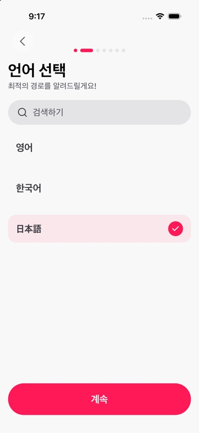 |
| 02 | 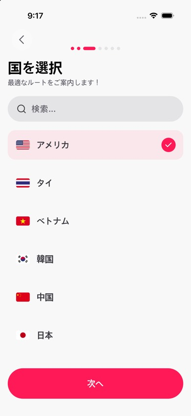 |
| 03 | 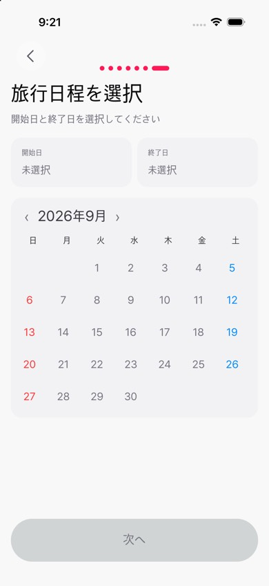 |
| 04 |  |
| 05 | 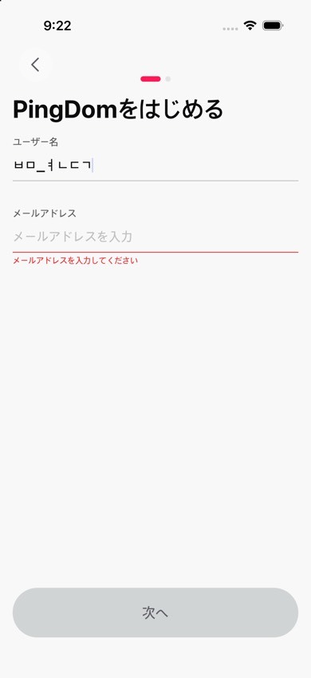 |
| 06 | 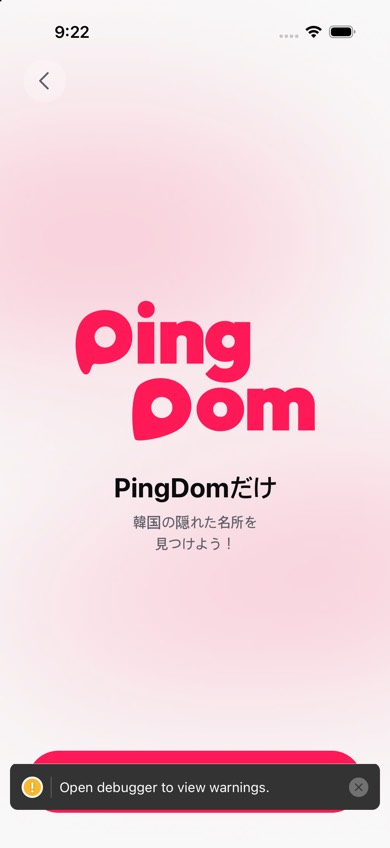 |
| 07 | 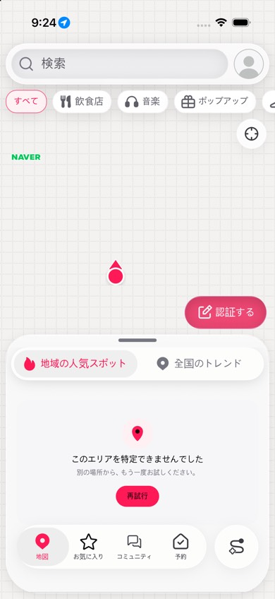 |
| 08 | 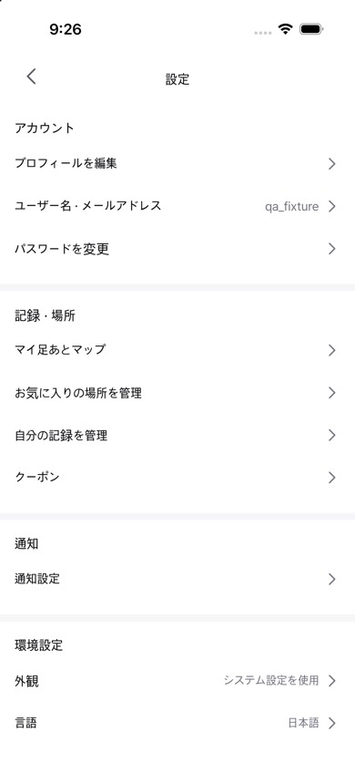 |
| 09 |  |
| 10 | 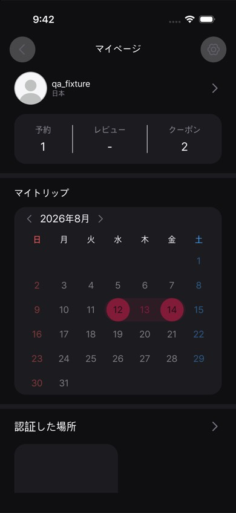 |
| 11 | 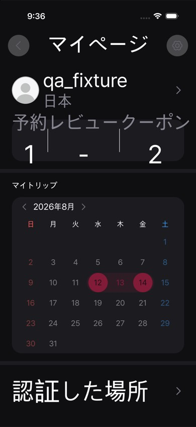 |
| 12 | 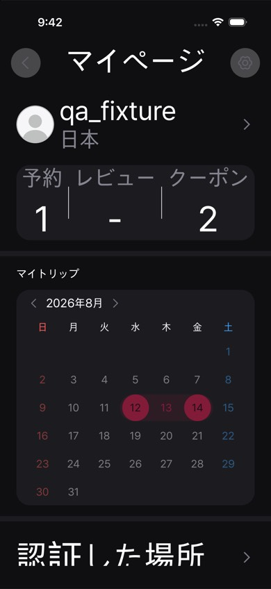 |
| 13 | 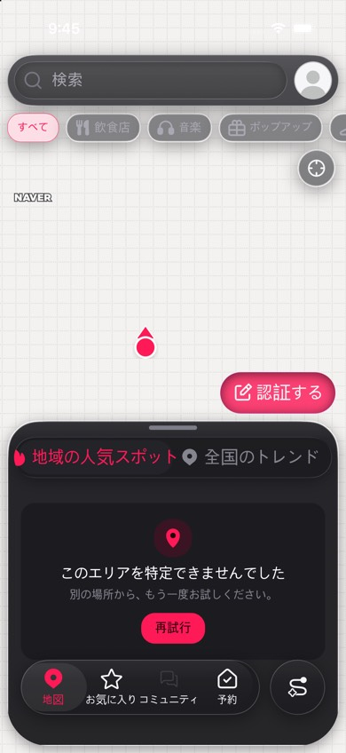 |
| 14 | 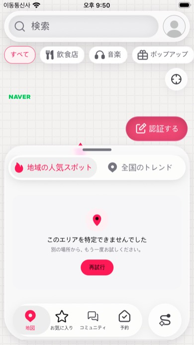 |
| 15 | 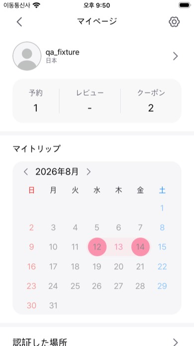 |
| 16 | 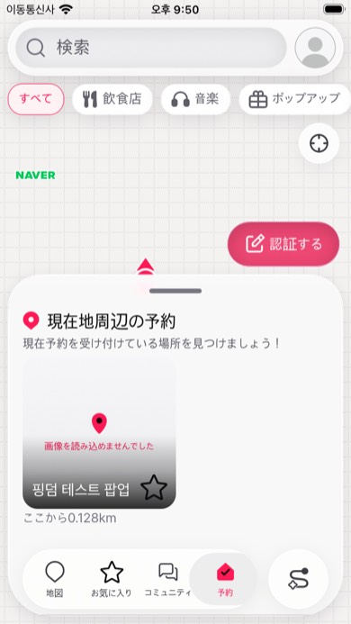 |
| 17 | 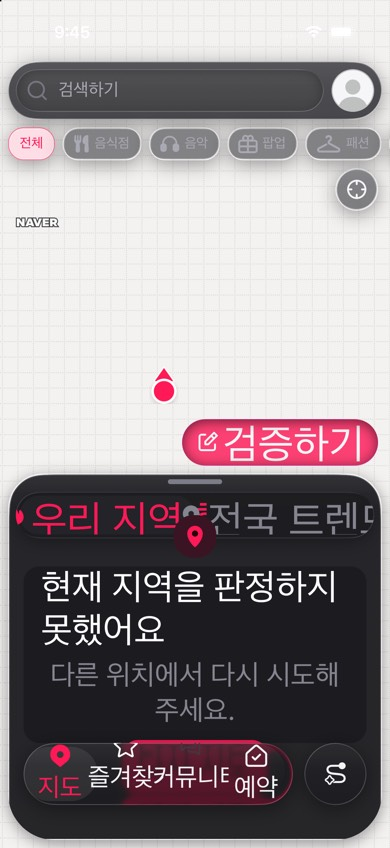 |
| 18 | 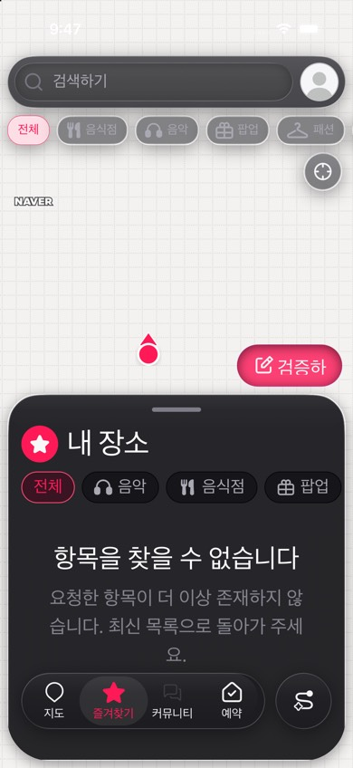 |

캡처 05의 사용자명 입력값은 시뮬레이터 한국어 키보드로 입력된 것이며 앱 문구가 아니다.

## 번역 검수

모든 ja 문구는 **기계 번역 초안이며 사람 검수가 필요하다.** 검수 대상 키 전체(1,443개, 우선 검수 299개)는
[389-ja-translation-review.md](389-ja-translation-review.md)에 있다.
